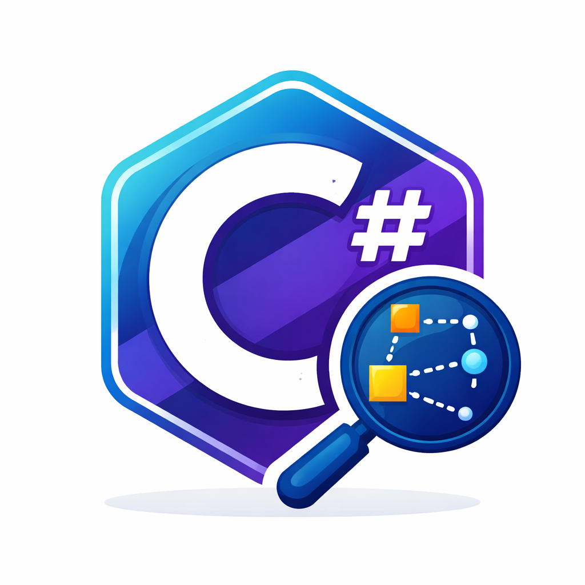

# RoslynMcp

A Model Context Protocol (MCP) server that brings Roslyn code intelligence to AI agents.


## Get It on NuGet

[](https://www.nuget.org/packages/RoslynMcp/)
[](https://www.nuget.org/packages/RoslynMcp/)

_This project uses Roslynator, licensed under Apache 2.0._

#### Installation

```bash
dotnet tool install -g RoslynMcp
```

#### Update

```bash
dotnet tool update -g RoslynMcp
```


#### MCP config (OpenCode)

```json
  "mcp": {
    "roslyn": {
      "type": "local",
      "command": [
        "roslynmcp"
      ]
    }
  }
```


## What It Is

RoslynMcp is a .NET application that exposes the power of [Roslyn](https://github.com/dotnet/roslyn) (the .NET compiler platform) through the MCP protocol. It acts as a bridge between AI assistants and your C# codebase, enabling deep code understanding and analysis.

## Why It Exists

Traditional AI code assistants often rely on simplistic pattern matching (grep/glob) which misses semantic context. RoslynMcp solves this by providing:

- **Semantic understanding** — It knows what your code *means*, not just what it *says*
- **Symbol resolution** — Understands types, methods, properties across your entire solution
- **Call graph tracing** — See how code flows through your system
- **Code smell detection** — Identifies potential issues using [Roslynator](https://github.com/dotnet/roslynator) analyzers

## What You Can Use It For

### `load_solution`

Use this tool when you need to start working with a .NET solution and no solution has been loaded yet. This must be the first tool called in a session before any code analysis or navigation tools can be used.

Parameters:
- `solutionHintPath` (optional): Absolute path to a `.sln` file, or to a directory used as the recursive discovery root for `.sln`/`.slnx` files. If omitted, the tool auto-detects from the current workspace.

### `load_project`

Use this tool when you need to list types declared in a specific project. It is useful for project-scoped discovery, for finding type symbols before follow-up calls such as `load_type` or `load_member`.

Parameters:
- `projectPath`: Exact path to a project file (`.csproj`), obtained from `load_solution`.

### `load_type`

Use this tool when you need to inspect type hierarchy and members declared by the specific type.

Parameters:
- `typeSymbolId`: The stable symbol ID of a type, obtained from `load_project`.

### `load_member`

Use this tool when you need callers/calles or overrides/implementations of a symbol.

Parameters:
- `memberSymbolId`: The stable symbol ID, obtained from `load_type`.

### `run_tests`

Default .NET test runner. Use this instead of `dotnet test` unless you need unsupported CLI behavior.

Parameters:
- `target` (optional): Execution target. Omit to run the currently loaded solution. Supports solution-relative or absolute `.sln`, `.slnx`, `.csproj`, or directory paths when the resolved target stays within the loaded solution directory.
- `filter` (optional): `dotnet test` filter expression, passed through where practical.

### Recommended Workflow

In practice, the usual flow is:

1. `load_solution`
2. `load_project`
3. `load_type`
4. `load_member`
5. `run_tests`

This keeps navigation semantic and symbol-aware without relying on text-only search.
